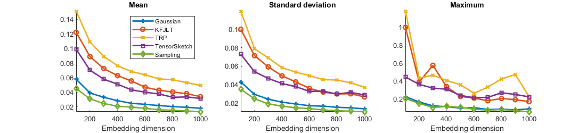
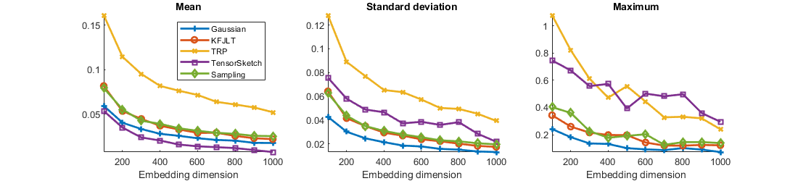
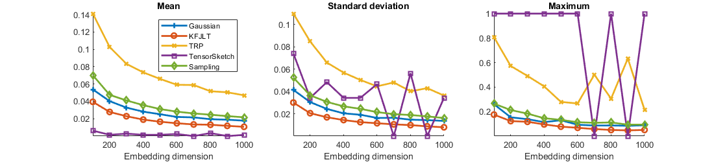

# Comparison of Different Methods for Sketching of Kronecker Vectors
This is an implementation of an experiment that compares five different sketch methods when applied to vectors with Kronecker structure. The experiment and its results are presented in our paper

O. A. Malik and S. Becker. Guarantees for the Kronecker Fast Johnson--Lindenstrauss Transform Using a Coherence and Sampling Argument. *To appear on arXiv soon*, 2019.

It is available at [TBA].

## Some Further Details
The script **experiment1** runs the experiment we present in our paper. It compares five different sketch types:
* A Gaussian sketch
* The Kronecker fast Johnson-Lindenstrauss transform (KFJLT)
* Tensor Random Projection (TRP)
* TensorSketch
* Sampling based on estimated leverage scores
The script allows choosing between three different distributions for the Kronecker vectors: normal, sparse, and a single large entry. The three figures below show the results we present in our paper for each of the three different distribution types. 


*Fig. 1: Normal distribution*


*Fig. 2: Sparse distribution*


*Fig. 3: Single large entry*

Please see our paper for further details.

## Requirements
Portions of our code requires Tensor Toolbox version 2.6 by Bader, Kolda and others (available at http://www.sandia.gov/~tgkolda/TensorToolbox/).

## Referencing This Code
If you use our code in any of your own work, please reference our paper:
```
TBA
``` 

We have tried our best to include references in our code to other works we use, so please also reference those works as appropriate.

## Author Contact Information
Please feel free to contact me at any time if you have any questions or would like to provide feedback on this code or on our paper. I can be reached at osman.malik@colorado.edu.